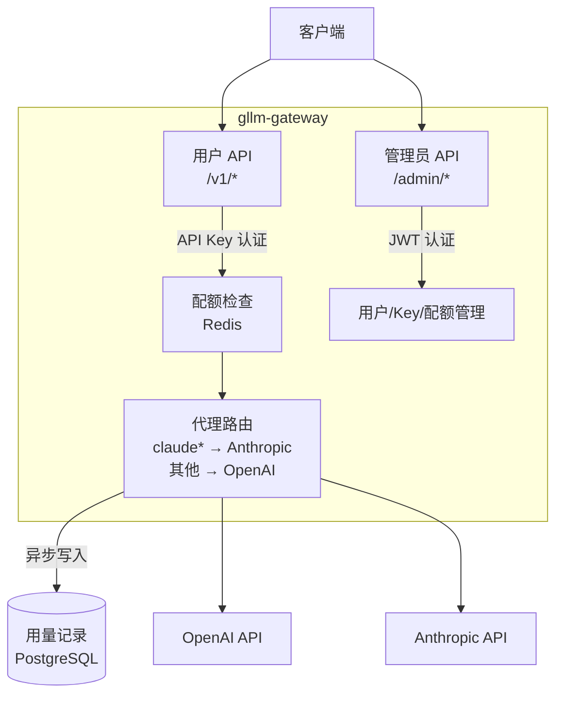

# 架构总览

## 系统架构



## 数据流

1. 客户端携带 `Authorization: Bearer <api-key>` 发起请求
2. `auth.Middleware` 从数据库查询 API Key 哈希，验证有效性，提取 `user_id`
3. `quota.Enforcer` 从 Redis 读取当前周期 Token 消耗，判断是否超限
4. `proxy.Router` 根据 `model` 字段前缀选择提供商，转发请求
5. 响应返回客户端后，`usage.Recorder` 异步将 Token 消耗写入 PostgreSQL

## 模块说明

| 模块 | 路径 | 职责 |
|------|------|------|
| `proxy` | `internal/proxy/` | 请求路由与转发，支持 OpenAI 和 Anthropic |
| `auth` | `internal/auth/` | API Key 中间件（用户）+ JWT 签发/验证（管理员）|
| `quota` | `internal/quota/` | Redis 计数器 + 配额检查，超限返回 429 |
| `usage` | `internal/usage/` | 将 Token 消耗与费用写入 PostgreSQL |
| `admin` | `internal/admin/` | 用户管理、Key 管理、配额管理、用量查询 API |
| `config` | `internal/config/` | 从 `config.yaml` 加载服务配置 |
| `db` | `internal/db/` | PostgreSQL 连接池 + SQL 迁移 |

## 数据库设计

```sql
-- 管理员账号
admins (id, email, password_hash, created_at)

-- 项目（用于按项目聚合配额）
projects (id, name, created_at)

-- 用户（status: pending | active | suspended）
users (id, email, name, status, project_id, created_at)

-- API Key（存储哈希值，明文仅在审批时返回一次）
api_keys (id, key_hash, user_id, status, created_at)
-- status: active | revoked

-- 配额规则（按用户或项目，按日或月）
quotas (id, subject_type, subject_id, limit_tokens, warning_threshold, period)
-- subject_type: user | project
-- period: daily | monthly

-- 用量记录（按请求粒度）
usage_records (id, user_id, project_id, provider, model,
               input_tokens, output_tokens, cost_usd, created_at)

-- 配额预警记录（防止重复通知）
quota_warnings (id, subject_type, subject_id, period_key, notified_at)

-- LLM 提供商配置（API Key 加密存储）
llm_providers (id, name, base_url, api_key_encrypted)
```

## 认证机制

| 场景 | 认证方式 | Header |
|------|---------|--------|
| 用户调用 LLM API | API Key | `Authorization: Bearer gw-xxx` |
| 管理员操作后台 | JWT（HS256） | `Authorization: Bearer eyJ...` |

API Key 以 `gw-` 前缀开头，存储时只保存 SHA-256 哈希值，明文仅在用户审批时返回一次。

## 技术栈

| 组件 | 选型 |
|------|------|
| HTTP 框架 | go-chi/chi v5 |
| 数据库 | PostgreSQL 14+（jackc/pgx v5）|
| 缓存/计数 | Redis 6+（go-redis v9）|
| 认证 | golang-jwt/jwt v5 |
| 密码哈希 | bcrypt（golang.org/x/crypto）|
| 配置 | YAML（gopkg.in/yaml.v3）|
